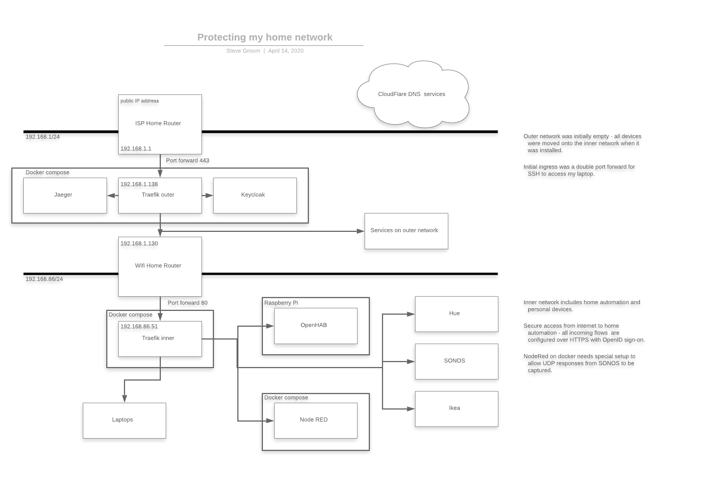

# Traefik setup with security first - Main Repo

<https://github.com/stevegroom/traefikGateway.git>

## Introduction

This repo is the result of trying to secure aspects of my home network such as:

- Secure access to my home automation tools
- Developing services when outside my home
- Sharing services to others
- Using cloud based devops services to trigger builds on premises

I decided to use Traefik but needed to add some other services to complete the setup. Most of this work is not original, but pulling it all into a single solution took me quite a lot of time, so hopefully this will help some of you.



### Exposing services

Most small networks use private ip address ranges (typically 192.168.1/24) and only allow ingress via a port forwarding mechanism. Traefik is designed to sit behind that one forwarded port and to provide access to other services via virtual hostnames. Define a wildcard domain to send all requests to your router's public address i.e. ```CNAME * myrouter.mydomain```

Once this is setup _anyservicename_.myrouter.mydomain will be addressed to the routers public address. Then use the portforwarding function of the router to send the traffic to Traefik!

So far so good. But, the most basic Traefik config will allow you to publish services without any additional security! - Before putting _```http://myhomeautomationpage.mydomain```_ on the internet for everybody to access, some additional setup should be prepared.

Encryption, Authentication, Authorization.

__Encryption__ - __Let's Encrypt__ is a free service that can be automatically provision TLS certificates to protect your services.

__Authentication__ - In this case I wanted to have a userid / password control system. A __basic auth__ middleware using .htaccess is one way to achieve this. I also wanted to be able to study openid / oauth / SAML sign on techniques - I opted to use __KeyCloak__ to provide SSO (single sign-on). If you publish multiple sites with the same SSO configuration, only the first one will request a user / password. The others will inherit the active security session.

__Authorization__ - Defining which parts of a service can be accessed by a user. Keycloak supports authentication, but the service you are protecting will also need to support OpenID or SAML to achieve this. Added to the to do list.

__Tracing requests__ - Traefik allows for requests to be captured by __Jaeger__ so you can see the history of network traffic passing through Traefik.

## Preparation

Before you try to start these services, several small preparation steps need to be complete.

Follow these steps in order to set this up. Traefik will not work until these are in place.

- Choose domain name and register if you do not already own it
- Register a cloudflare account
- Delegate the responsibility to manage your chosen subdomain to cloudflare
- Generate cloudflare access tokens

### Domain Name Registrar

Decide on a domain name to use for all the incoming requests. For simplicty I registered a new domain in order that I could use ```*.mydomain CNAME router.mydomain```. Look out for conflicts for existing DNS entries.

### DNS Server

My Domain Registrar does not offer an API to manage the DNS records. I found and set up a free account on cloudflare to manage mydomain. I then updated my Domain Registrar nameserver entries to point to the assigned cloudflare DNS servers.

### DNS API Key

Why a DNS API? Well in order for Let's Encrypt (LE) to create a certificate for your domain it must ascertain that you
control that domain. LE will use the API to create an entry in your DNS domain and if successful it will issue a certificate.

On cloudflare you create an __API access key__ with DNS:Edit and ZONE:Read access for your domains.

### Let's Encrypt

I don't think anything needs to be done here - it handles the requests per domain and is rate capped to 50 certificates per week. Uncomment the acme-staging entry during your initial setup to avoid hitting this cap. This site uses a single wildcard domain name.

```text
Certificate Name: yourdomain
Subject Alternate Name: *.yourdomain
```

This certificate can be used to secure every web service that is a subdomain of yourdomain. This may be considered a
risk for more secure applications, so may want some dedicated certificates for more critical services.

## Installation

- Define your domain name
- Register the domain name
- Use cloudflare to manage the DNS entries
- Create a CloudFlare access token
- ```git clone https://github.com/stevegroom/traefikGateway.git```
- Copy each of the .env_sample files at .env
- Edit each .env file with your values
  
For the first execution, keycloak is not yet set up so cannot be used for logon.
Edit ```traefik/docker-compose.yml``` lines 377 / 379 uncomment
```traefik.http.routers.traefik.middlewares=usersfile@file``` and comment out
```traefik.http.routers.traefik.middlewares=keycloakForwardAuth@docker```

- Copy usersfile.htpasswd from confModel to conf
- Create an .htpassword format user record in this file (google 'create .htpasswd webpage')

The services should be ready to start

```bash
cd traefikGateway/jaeger
docker-compose up --detach;docker-compose logs --tail 0 --follow
^C to exit
cd ../traefik
docker-compose up --detach;docker-compose logs --tail 0 --follow
```

Note, as docker compose does not wait on services to be operational, there are several restarts obseved during the startup. It normally settles down after five minutes.

You should be able to access https://traefik.yourdomain and be requested userid / password via basic auth.

https://keycloak.yourdomain will also be running, so be sure to set up the initial password before anyone else does!

## Drilling deeper

I needed to route queries from the internet through _two_ traefik instances, this repo creates the secure ingress point, and a second repo <https://github.com/stevegroom/traefikGatewayInner.git> runs on the inner subnet to route those services.

Manual yml conf entries are created in this repo to map to the services that are exposed on TraefikGatwayInner.

## Odds 'n Ends

### Let's Encrypt certificates

As Traefik acts as the secure proxy for your services, it reqests the certificate to be issued by Let's Encrypt and stores the certificate in an ```acme.json``` file. If you need a ```.key``` and a ```.cert``` file for another service you can use the following tool to extract the keys.

<https://hub.docker.com/r/danielhuisman/traefik-certificate-extractor>

```danielhuisman/traefik-certificate-extractor```

```bash
docker run --name extractor -d -v /srv/traefik/acme:/app/data -v /srv/extractor/certs:/app/certs danielhuisman/traefik-certificate-extractor
docker ps | grep extractor
docker exec -it extractor /bin/sh
cat README.md
python3 extractor.py ./data
^d
docker stop extractor
docker rm extractor
```

## Traefik messages

### Skipping same configuration

```log
traefik                 | time="2020-10-31T12:04:52+01:00" level=info msg="Skipping same configuration" providerName=file
traefik                 | time="2020-10-31T12:04:52+01:00" level=info msg="Skipping same configuration" providerName=file
```

This means that some config elements found in a file provider are already defined, but are not
contradicting what is defined previously.
